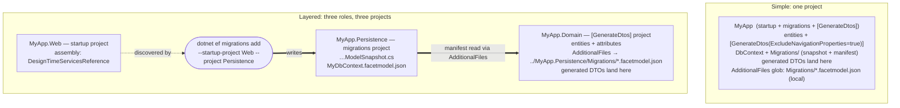

# Facet.Extensions.EFCore

EF Core async extension methods for the Facet library, enabling one-line async mapping and projection between your domain entities and generated facet types.

## Key Features

- **Forward Mapping**: Entity -> Facet DTO
  - Async projection to `List<TTarget>`: `ToFacetsAsync<TSource,TTarget>()` or `ToFacetsAsync<TTarget>()`
  - Async projection to first or default: `FirstFacetAsync<TSource,TTarget>()` or `FirstFacetAsync<TTarget>()`
  - Async projection to single: `SingleFacetAsync<TSource,TTarget>()` or `SingleFacetAsync<TTarget>()`
  - **Automatic Navigation Property Loading**: No `.Include()` required for nested facets!

- **Reverse Mapping**: Facet DTO -> Entity
  - Selective entity updates: `UpdateFromFacet<TEntity,TFacet>()`
  - Async entity updates: `UpdateFromFacetAsync<TEntity,TFacet>()`
  - Update with change tracking: `UpdateFromFacetWithChanges<TEntity,TFacet>()`

All methods leverage your already generated ctor or Projection property and require EF Core 6+.

## Getting Started

### 1. Install packages

```bash
dotnet add package Facet.Extensions.EFCore
```

### 2. Import namespaces

```csharp
using Facet.Extensions.EFCore; // for async EF Core extension methods
```

## Forward Mapping (Entity -> DTO)

### 3. Use async mapping in EF Core

```csharp
// Async projection to list (source type inferred)
var dtos = await dbContext.People.ToFacetsAsync<PersonDto>();

// Async projection to first or default (source type inferred)
var firstDto = await dbContext.People.FirstFacetAsync<PersonDto>();

// Async projection to single (source type inferred)
var singleDto = await dbContext.People.SingleFacetAsync<PersonDto>();

// Legacy explicit syntax still supported
var dtosExplicit = await dbContext.People.ToFacetsAsync<Person, PersonDto>();
```

### 4. Automatic Navigation Property Loading (No `.Include()` Required!)

```csharp
// Define nested facets
[Facet(typeof(Address))]
public partial record AddressDto;

[Facet(typeof(Company), NestedFacets = [typeof(AddressDto)])]
public partial record CompanyDto;

// Navigation properties are automatically loaded - no .Include() needed!
var companies = await dbContext.Companies
    .Where(c => c.IsActive)
    .ToFacetsAsync<CompanyDto>();

// The HeadquartersAddress navigation property is automatically included!
// EF Core analyzes the projection expression and generates the necessary JOINs

// This also works with collections:
[Facet(typeof(OrderItem))]
public partial record OrderItemDto;

[Facet(typeof(Order), NestedFacets = [typeof(OrderItemDto), typeof(AddressDto)])]
public partial record OrderDto;

var orders = await dbContext.Orders
    .ToFacetsAsync<OrderDto>();  // Automatically includes Items collection and ShippingAddress!

// All these methods support auto-include:
await dbContext.Companies.ToFacetsAsync<CompanyDto>();
await dbContext.Companies.FirstFacetAsync<CompanyDto>();
await dbContext.Companies.SingleFacetAsync<CompanyDto>();
await dbContext.Companies.SelectFacet<CompanyDto>().ToListAsync();
```

## Streaming with AsAsyncEnumerable

**Facet fully supports EF Core's streaming patterns using `AsAsyncEnumerable()`** for memory-efficient processing of large result sets:

```csharp
// Stream results one at a time instead of loading all into memory
await foreach (var userDto in dbContext.Users
    .Where(u => u.IsActive)
    .SelectFacet<UserDto>()        // Apply facet projection
    .AsAsyncEnumerable())           // Stream results
{
    // Process each item as it's retrieved from the database
    await ProcessUserAsync(userDto);
}

// Works with complex queries
await foreach (var companyDto in dbContext.Companies
    .Where(c => c.Revenue > 1000000)
    .OrderBy(c => c.Name)
    .SelectFacet<CompanyDto>()      // Nested facets are automatically loaded
    .AsAsyncEnumerable())
{
    Console.WriteLine($"{companyDto.Name}: {companyDto.HeadquartersAddress?.City}");
}

// Memory-efficient pagination
await foreach (var productDto in dbContext.Products
    .OrderBy(p => p.Id)
    .Skip(page * pageSize)
    .Take(pageSize)
    .SelectFacet<ProductDto>()
    .AsAsyncEnumerable())
{
    yield return productDto;
}
```

**Important:** Always call `SelectFacet()` **before** `AsAsyncEnumerable()`:
- **Correct:** `.SelectFacet<Dto>().AsAsyncEnumerable()` - Projection happens in SQL
- **Incorrect:** `.AsAsyncEnumerable().Select(x => x.ToFacet<Dto>())` - Loads full entities into memory first

The correct order ensures that:
1. The projection is translated to SQL (efficient database query)
2. Only the projected columns are retrieved from the database
3. Results are streamed without loading everything into memory

## Reverse Mapping (DTO -> Entity)

### 4. Use selective entity updates

```csharp
// Define update DTO (excludes sensitive/immutable properties)
[Facet(typeof(User), "Password", "CreatedAt")]
public partial class UpdateUserDto { }

// API Controller
[HttpPut("{id}")]
public async Task<IActionResult> UpdateUser(int id, UpdateUserDto dto)
{
    var user = await context.Users.FindAsync(id);
    if (user == null) return NotFound();
    
    // Only updates properties that actually changed
    user.UpdateFromFacet(dto, context);
    
    await context.SaveChangesAsync();
    return NoContent();
}
```

### 5. Advanced scenarios

```csharp
// With change tracking for auditing
var result = user.UpdateFromFacetWithChanges(dto, context);
if (result.HasChanges)
{
    logger.LogInformation("User {UserId} updated. Changed: {Properties}", 
        user.Id, string.Join(", ", result.ChangedProperties));
}

// Async version (for future extensibility)
await user.UpdateFromFacetAsync(dto, context);
```

## Complete Example

```csharp
// Domain entity
public class Product
{
    public int Id { get; set; }
    public string Name { get; set; }
    public string Description { get; set; }
    public decimal Price { get; set; }
    public DateTime CreatedAt { get; set; }  // Immutable
    public string InternalNotes { get; set; }  // Sensitive
}

// Read DTO (for GET operations)
[Facet(typeof(Product), "InternalNotes")]
public partial class ProductDto { }

// Update DTO (for PUT operations - excludes immutable/sensitive fields)
[Facet(typeof(Product), "Id", "CreatedAt", "InternalNotes")]
public partial class UpdateProductDto { }

// API Controller
[ApiController]
[Route("api/[controller]")]
public class ProductsController : ControllerBase
{
    private readonly ApplicationDbContext _context;
    
    public ProductsController(ApplicationDbContext context)
    {
        _context = context;
    }
    
    // GET: Forward mapping (Entity -> DTO)
    [HttpGet]
    public async Task<ActionResult<IEnumerable<ProductDto>>> GetProducts()
    {
        return await _context.Products
            .Where(p => p.IsActive)
            .ToFacetsAsync<ProductDto>();  // Source type inferred
    }
    
    [HttpGet("{id}")]
    public async Task<ActionResult<ProductDto>> GetProduct(int id)
    {
        var product = await _context.Products
            .Where(p => p.Id == id)
            .FirstFacetAsync<ProductDto>();  // Source type inferred
            
        return product == null ? NotFound() : product;
    }
    
    // PUT: Reverse mapping (DTO -> Entity)
    [HttpPut("{id}")]
    public async Task<IActionResult> UpdateProduct(int id, UpdateProductDto dto)
    {
        var product = await _context.Products.FindAsync(id);
        if (product == null) return NotFound();
        
        // Selective update - only changed properties
        var result = product.UpdateFromFacetWithChanges(dto, _context);
        
        if (result.HasChanges)
        {
            await _context.SaveChangesAsync();
            
            // Optional: Log what changed
            logger.LogInformation("Product {ProductId} updated. Changed: {Properties}", 
                id, string.Join(", ", result.ChangedProperties));
        }
        
        return NoContent();
    }
}
```

## Design-Time Services: the EF Model Manifest

`[GenerateDtos(ExcludeNavigationProperties = true)]` shapes a DTO from the EF model's own
navigation designation — it is **driven entirely by a model manifest**, with no type-shape
heuristic. This package's design-time services write that manifest
(`{ContextName}.facetmodel.json`) beside the migrations model snapshot every time you run
`dotnet ef migrations add`/`remove`, recording per entity exactly which properties EF maps as
data (scalar columns, complex properties, primitive collections) and which are navigations,
owned references, skip navigations, or explicitly ignored. A source type using
`ExcludeNavigationProperties` with no manifest entry is a compile error (**FAC105**) — there
is nothing to guess from.

### Where each piece lives

There is no separate "DTO project": the generated DTOs are emitted into whichever project
declares the `[GenerateDtos]` attributes. What can be surprising is that in a layered solution
**three different projects** are involved, and the manifest is written into one project
(next to the snapshot) but read by the generator running in another — so the `<AdditionalFiles>`
glob reaches *across* projects. In a single-project app all three roles collapse into one and
every path is local.



| Role | `dotnet ef` flag | What goes here | Layered example |
|------|------------------|----------------|-----------------|
| **Startup project** | `--startup-project` (or current) | the `DesignTimeServicesReference` attribute | `MyApp.Web` |
| **Migrations project** | `--project` (or current) | the snapshot **and the generated `{Context}.facetmodel.json`** | `MyApp.Persistence` |
| **`[GenerateDtos]` project** | *(not an ef flag)* | the attributes, the `<AdditionalFiles>` glob, and the generated DTOs | `MyApp.Domain` |

### 1. Register the design-time services (startup project)

The attribute goes in the **startup project** — the one you pass to `dotnet ef` via
`--startup-project` (or the current project if you don't pass one). It's an assembly-level
attribute, so any compiled `.cs` file works; conventionally `Properties/AssemblyInfo.cs` or a
small dedicated file:

```csharp
[assembly: Microsoft.EntityFrameworkCore.Design.DesignTimeServicesReference(
    "Facet.Extensions.EFCore.Design.FacetDesignTimeServices, Facet.Extensions.EFCore")]
```

Or, with no new file, generate it from the startup project's `.csproj`:

```xml
<ItemGroup>
  <AssemblyAttribute Include="Microsoft.EntityFrameworkCore.Design.DesignTimeServicesReference">
    <_Parameter1>Facet.Extensions.EFCore.Design.FacetDesignTimeServices, Facet.Extensions.EFCore</_Parameter1>
  </AssemblyAttribute>
</ItemGroup>
```

The startup project must reference `Facet.Extensions.EFCore` (directly or transitively) so
the assembly named in the attribute is present in its output for `dotnet ef` to load.

With the services registered, the manifest is now written **automatically** whenever you add
or remove a migration — it rides the migration you were already creating for the schema change:

```bash
dotnet ef migrations add AddSchedule --project ../MyApp.Persistence --startup-project .
# → also (re)writes MyApp.Persistence/Migrations/MyDbContext.facetmodel.json
```

Nothing else in the design-time services touches it — not `build`, not `database update`, not
`dbcontext info` — so the manifest changes only when your migrations do. That is exactly what
makes it a committed drift guard (below). It also means you don't need it fresh on every build;
you need it fresh whenever the mapped shape changes, which is when you add a migration anyway.

Adopting on an existing application with no model change pending? A migration add/remove pair
bootstraps the manifest with no leftover migration, and a small tool covers `dotnet ef`-free
workflows — see
[Producing the manifest without a migration](#producing-the-manifest-without-a-migration). You
never have to keep a no-op migration to have a manifest.

Each `DbContext` writes its own `{Context}.facetmodel.json`; if you have several, the generator
merges them (a property mapped as data in any context is kept).

### 2. Expose the manifest to the generator (the `[GenerateDtos]` project)

Point `<AdditionalFiles>` at wherever the migrations project keeps the manifest. That is
almost always a **relative path into the migrations project**, not a local folder:

```xml
<ItemGroup>
  <!-- from MyApp.Domain, reaching into MyApp.Persistence -->
  <AdditionalFiles Include="..\MyApp.Persistence\Migrations\*.facetmodel.json" />
</ItemGroup>
```

> Mind the path: an `<AdditionalFiles>` glob that matches nothing is silently empty — the
> compiler simply receives no file. Because `ExcludeNavigationProperties` requires a manifest,
> a wrong path surfaces as FAC105 on every such type rather than a quiet wrong result.

Commit the manifest like you commit the snapshot. For every entity listed in it,
`ExcludeNavigationProperties` keeps exactly the mapped data properties — value-converted
columns survive (the model maps them as data), EF-ignored (`[NotMapped]`) properties drop.
`IncludeProperties` still wins for aggregate children you want in the DTO.

### Drift is a build failure, for free

Because the committed manifest changes only when you regenerate it, it makes your build a
schema-drift guard: add a mapped property but forget to regenerate (no migration, or a
programmatic run you didn't rerun) and the generator emits **FAC106** — the property is unknown
to the model, so it would silently vanish from the DTO.
FAC106 is a warning by default so mid-development edits don't block the build; escalate it for
CI so a stale manifest can't merge:

```xml
<PropertyGroup>
  <WarningsAsErrors>$(WarningsAsErrors);FAC106</WarningsAsErrors>
</PropertyGroup>
```

FAC105 (no manifest entry at all) is already an error. Together they mean a PR that changes the
model without regenerating the manifest cannot merge green — your DTO contracts can't silently
drift from your schema.

### Producing the manifest without a migration

The most common adoption case is an existing application with a migration history and **no
model change pending** — `migrations add` alone would create a migration you don't want. You
don't need a tool for that case: the hook fires on `remove` too, so an add/remove pair
bootstraps the manifest and leaves no migration behind:

```bash
dotnet ef migrations add FacetBootstrap    # writes the manifest (and a temp migration)
dotnet ef migrations remove                # deletes the migration; the manifest stays, rewritten
```

(`remove` re-scaffolds the snapshot from the remaining migrations and the hook rewrites the
manifest beside it; if `FacetBootstrap` was your only migration, the manifest written by the
`add` simply remains. Nothing is applied to a database at any point.)

For everything else, the migration hook is just a convenient caller of a public API — the
manifest is an ordinary file, and `FacetEfModelManifest.Build`/`Write` produce it from a model
directly. Reach for the API when:

- **No migration churn / no `dotnet ef`** — you keep the manifest current some other way (a
  pre-build target, a `dotnet run` tool, a checked-in generator step) and don't want a schema
  command in the loop.
- **A drift-check test** — assert the committed manifest equals `Build(model)` in CI, so a
  stale manifest fails a test instead of only surfacing as FAC106 in a downstream build.

A ~15-line console tool is the usual shape (this is what a real-world consumer uses):

```csharp
using var context = new MyDbContext(/* design-time options; never connects */);
// Pass the DESIGN-TIME model, not context.Model:
var model = context.GetService<IDesignTimeModel>().Model;
FacetEfModelManifest.Write(model, "../MyApp.Persistence/Migrations", nameof(MyDbContext));
```

`DbContext.Model` is the runtime model and has no convention metadata, so it reports zero
explicitly ignored (`[NotMapped]`/`Ignore(...)`) members — which would turn every one of them
into a spurious FAC106. `IDesignTimeModel.Model` carries them. The migration hook already uses
the design-time model, so the `dotnet ef` path gets this right for free; a hand-written tool
must ask for it explicitly.

## Advanced: Custom Mapping Support

For complex mappings that cannot be expressed as SQL projections (e.g., calling external services, complex type conversions like Vector2, or async operations), see the **[Facet.Extensions.EFCore.Mapping](https://www.nuget.org/packages/Facet.Extensions.EFCore.Mapping)** package.

```bash
dotnet add package Facet.Extensions.EFCore.Mapping
```

This optional package provides custom async mapper support with dependency injection for advanced scenarios. See the [Facet.Extensions.EFCore.Mapping README](../Facet.Extensions.EFCore.Mapping/README.md) for details.

## API Reference

| Method | Description | Use Case |
|--------|-------------|----------|
| `ToFacetsAsync<TTarget>()` | Project query to DTO list (source inferred) | GET endpoints |
| `ToFacetsAsync<TSource, TTarget>()` | Project query to DTO list (explicit types) | Legacy/explicit typing |
| `FirstFacetAsync<TTarget>()` | Get first DTO or null (source inferred) | GET single item |
| `FirstFacetAsync<TSource, TTarget>()` | Get first DTO or null (explicit types) | Legacy/explicit typing |
| `SingleFacetAsync<TTarget>()` | Get single DTO (source inferred) | GET unique item |
| `SingleFacetAsync<TSource, TTarget>()` | Get single DTO (explicit types) | Legacy/explicit typing |
| `SelectFacet<TTarget>().AsAsyncEnumerable()` | Stream projected results | Memory-efficient large result sets |
| `SelectFacet<TSource, TTarget>().AsAsyncEnumerable()` | Stream projected results (explicit) | Memory-efficient large result sets |
| `UpdateFromFacet<TEntity, TFacet>()` | Selective entity update | PUT/PATCH endpoints |
| `UpdateFromFacetWithChanges<TEntity, TFacet>()` | Update with change tracking | Auditing scenarios |
| `UpdateFromFacetAsync<TEntity, TFacet>()` | Async selective update | Future extensibility |

For custom async mapper overloads, see [Facet.Extensions.EFCore.Mapping](https://www.nuget.org/packages/Facet.Extensions.EFCore.Mapping).

## Requirements

- Facet v1.6.0+
- Entity Framework Core 6+
- .NET 6+
