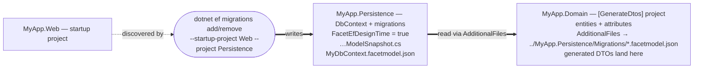

# Facet.Extensions.EFCore

EF Core async extension methods for the Facet library, enabling one-line async mapping and projection between your domain entities and generated facet types.

## Key Features

- **Forward Mapping**: Entity -> Facet DTO
  - Async projection to `List<TTarget>`: `ToFacetsAsync<TSource,TTarget>()` or `ToFacetsAsync<TTarget>()`
  - Async projection to first or default: `FirstFacetAsync<TSource,TTarget>()` or `FirstFacetAsync<TTarget>()`
  - Async projection to single: `SingleFacetAsync<TSource,TTarget>()` or `SingleFacetAsync<TTarget>()`
  - **Automatic Navigation Property Loading**: No `.Include()` required for nested facets!

- **Reverse Mapping**: Facet DTO -> Entity
  - Selective entity updates: `UpdateFromFacet<TEntity,TFacet>()`
  - Async entity updates: `UpdateFromFacetAsync<TEntity,TFacet>()`
  - Update with change tracking: `UpdateFromFacetWithChanges<TEntity,TFacet>()`

All methods leverage your already generated ctor or Projection property and require EF Core 6+.

## Getting Started

### 1. Install packages

```bash
dotnet add package Facet.Extensions.EFCore
```

### 2. Import namespaces

```csharp
using Facet.Extensions.EFCore; // for async EF Core extension methods
```

## Forward Mapping (Entity -> DTO)

### 3. Use async mapping in EF Core

```csharp
// Async projection to list (source type inferred)
var dtos = await dbContext.People.ToFacetsAsync<PersonDto>();

// Async projection to first or default (source type inferred)
var firstDto = await dbContext.People.FirstFacetAsync<PersonDto>();

// Async projection to single (source type inferred)
var singleDto = await dbContext.People.SingleFacetAsync<PersonDto>();

// Legacy explicit syntax still supported
var dtosExplicit = await dbContext.People.ToFacetsAsync<Person, PersonDto>();
```

### 4. Automatic Navigation Property Loading (No `.Include()` Required!)

```csharp
// Define nested facets
[Facet(typeof(Address))]
public partial record AddressDto;

[Facet(typeof(Company), NestedFacets = [typeof(AddressDto)])]
public partial record CompanyDto;

// Navigation properties are automatically loaded - no .Include() needed!
var companies = await dbContext.Companies
    .Where(c => c.IsActive)
    .ToFacetsAsync<CompanyDto>();

// The HeadquartersAddress navigation property is automatically included!
// EF Core analyzes the projection expression and generates the necessary JOINs

// This also works with collections:
[Facet(typeof(OrderItem))]
public partial record OrderItemDto;

[Facet(typeof(Order), NestedFacets = [typeof(OrderItemDto), typeof(AddressDto)])]
public partial record OrderDto;

var orders = await dbContext.Orders
    .ToFacetsAsync<OrderDto>();  // Automatically includes Items collection and ShippingAddress!

// All these methods support auto-include:
await dbContext.Companies.ToFacetsAsync<CompanyDto>();
await dbContext.Companies.FirstFacetAsync<CompanyDto>();
await dbContext.Companies.SingleFacetAsync<CompanyDto>();
await dbContext.Companies.SelectFacet<CompanyDto>().ToListAsync();
```

## Streaming with AsAsyncEnumerable

**Facet fully supports EF Core's streaming patterns using `AsAsyncEnumerable()`** for memory-efficient processing of large result sets:

```csharp
// Stream results one at a time instead of loading all into memory
await foreach (var userDto in dbContext.Users
    .Where(u => u.IsActive)
    .SelectFacet<UserDto>()        // Apply facet projection
    .AsAsyncEnumerable())           // Stream results
{
    // Process each item as it's retrieved from the database
    await ProcessUserAsync(userDto);
}

// Works with complex queries
await foreach (var companyDto in dbContext.Companies
    .Where(c => c.Revenue > 1000000)
    .OrderBy(c => c.Name)
    .SelectFacet<CompanyDto>()      // Nested facets are automatically loaded
    .AsAsyncEnumerable())
{
    Console.WriteLine($"{companyDto.Name}: {companyDto.HeadquartersAddress?.City}");
}

// Memory-efficient pagination
await foreach (var productDto in dbContext.Products
    .OrderBy(p => p.Id)
    .Skip(page * pageSize)
    .Take(pageSize)
    .SelectFacet<ProductDto>()
    .AsAsyncEnumerable())
{
    yield return productDto;
}
```

**Important:** Always call `SelectFacet()` **before** `AsAsyncEnumerable()`:
- **Correct:** `.SelectFacet<Dto>().AsAsyncEnumerable()` - Projection happens in SQL
- **Incorrect:** `.AsAsyncEnumerable().Select(x => x.ToFacet<Dto>())` - Loads full entities into memory first

The correct order ensures that:
1. The projection is translated to SQL (efficient database query)
2. Only the projected columns are retrieved from the database
3. Results are streamed without loading everything into memory

## Reverse Mapping (DTO -> Entity)

### 4. Use selective entity updates

```csharp
// Define update DTO (excludes sensitive/immutable properties)
[Facet(typeof(User), "Password", "CreatedAt")]
public partial class UpdateUserDto { }

// API Controller
[HttpPut("{id}")]
public async Task<IActionResult> UpdateUser(int id, UpdateUserDto dto)
{
    var user = await context.Users.FindAsync(id);
    if (user == null) return NotFound();
    
    // Only updates properties that actually changed
    user.UpdateFromFacet(dto, context);
    
    await context.SaveChangesAsync();
    return NoContent();
}
```

### 5. Advanced scenarios

```csharp
// With change tracking for auditing
var result = user.UpdateFromFacetWithChanges(dto, context);
if (result.HasChanges)
{
    logger.LogInformation("User {UserId} updated. Changed: {Properties}", 
        user.Id, string.Join(", ", result.ChangedProperties));
}

// Async version (for future extensibility)
await user.UpdateFromFacetAsync(dto, context);
```

## Complete Example

```csharp
// Domain entity
public class Product
{
    public int Id { get; set; }
    public string Name { get; set; }
    public string Description { get; set; }
    public decimal Price { get; set; }
    public DateTime CreatedAt { get; set; }  // Immutable
    public string InternalNotes { get; set; }  // Sensitive
}

// Read DTO (for GET operations)
[Facet(typeof(Product), "InternalNotes")]
public partial class ProductDto { }

// Update DTO (for PUT operations - excludes immutable/sensitive fields)
[Facet(typeof(Product), "Id", "CreatedAt", "InternalNotes")]
public partial class UpdateProductDto { }

// API Controller
[ApiController]
[Route("api/[controller]")]
public class ProductsController : ControllerBase
{
    private readonly ApplicationDbContext _context;
    
    public ProductsController(ApplicationDbContext context)
    {
        _context = context;
    }
    
    // GET: Forward mapping (Entity -> DTO)
    [HttpGet]
    public async Task<ActionResult<IEnumerable<ProductDto>>> GetProducts()
    {
        return await _context.Products
            .Where(p => p.IsActive)
            .ToFacetsAsync<ProductDto>();  // Source type inferred
    }
    
    [HttpGet("{id}")]
    public async Task<ActionResult<ProductDto>> GetProduct(int id)
    {
        var product = await _context.Products
            .Where(p => p.Id == id)
            .FirstFacetAsync<ProductDto>();  // Source type inferred
            
        return product == null ? NotFound() : product;
    }
    
    // PUT: Reverse mapping (DTO -> Entity)
    [HttpPut("{id}")]
    public async Task<IActionResult> UpdateProduct(int id, UpdateProductDto dto)
    {
        var product = await _context.Products.FindAsync(id);
        if (product == null) return NotFound();
        
        // Selective update - only changed properties
        var result = product.UpdateFromFacetWithChanges(dto, _context);
        
        if (result.HasChanges)
        {
            await _context.SaveChangesAsync();
            
            // Optional: Log what changed
            logger.LogInformation("Product {ProductId} updated. Changed: {Properties}", 
                id, string.Join(", ", result.ChangedProperties));
        }
        
        return NoContent();
    }
}
```

## Shaping DTOs with your EF model: `ExcludeNavigationProperties`

If your entities are mapped by EF Core, they carry navigation properties — `Order.Customer`,
`Customer.Orders`, back-references, owned types. `[GenerateDtos]` copies properties as it
finds them, so without shaping, every generated DTO drags those navigations along **as raw
entity types**: serializer cycles, accidental graph exposure, bloated wire contracts.

Manifest shaping fixes that by generating **exactly what EF maps as data** — scalar columns,
complex/value-object members, primitive collections — and dropping navigations, skip
navigations, owned references, and `[NotMapped]` members. It reads the truth from a **model
manifest**: a small committed JSON file generated from your actual `DbContext` model at
design time. Once a manifest is wired into a project, every `[GenerateDtos]` DTO there is
shaped by default; a shaped type with no manifest entry is a compile error (FAC105), never a
silently mis-shaped DTO.

Setup is three steps, once. The assumed starting point is the normal one: an existing
application with a `DbContext` and a migrations history, no model change in flight, on a
clean branch.

### Step 1 — Install the package and switch on the design-time hook

`Facet.Extensions.EFCore` is its own NuGet package. Add it to the project that has your
`DbContext`, and set one property in that same `.csproj`:

```bash
dotnet add MyApp.Persistence package Facet.Extensions.EFCore
```

```xml
<PropertyGroup>
  <FacetEfDesignTime>true</FacetEfDesignTime>
</PropertyGroup>
```

The property does two things. It emits an assembly attribute that tells `dotnet ef` to load
Facet's design-time services — EF reads that attribute from the `DbContext` project's
assembly and from the startup assembly (`--startup-project`), so the property works in
either; the `DbContext` project is the natural home, since the package is already there. And
it wires the project's **own** `*.facetmodel.json` files into the compilation as
AdditionalFiles, so if your `[GenerateDtos]` attributes live in this same project, this
property is the only knob you will touch. It changes nothing at runtime, and it is opt-in on
purpose: a package reference alone never changes what your migrations write or what the
compiler consumes.

Prefer the registration visible in code — or have `GenerateAssemblyInfo` disabled? (Both the
property and raw `<AssemblyAttribute>` items are emitted through the SDK's generated
AssemblyInfo file, so neither works without it.) The attribute is one line in any compiled
`.cs` file, and this form always works:

```csharp
[assembly: Microsoft.EntityFrameworkCore.Design.DesignTimeServicesReference(
    "Facet.Extensions.EFCore.Design.FacetDesignTimeServices, Facet.Extensions.EFCore")]
```

The raw `<AssemblyAttribute>` item in a `.csproj` is what the property expands to, if you'd
rather see it spelled out:

```xml
<ItemGroup>
  <AssemblyAttribute Include="Microsoft.EntityFrameworkCore.Design.DesignTimeServicesReference">
    <_Parameter1>Facet.Extensions.EFCore.Design.FacetDesignTimeServices, Facet.Extensions.EFCore</_Parameter1>
  </AssemblyAttribute>
</ItemGroup>
```

Registering it more than once is harmless — EF de-duplicates. From now on, every
`dotnet ef migrations add`/`remove` that leaves a model snapshot in place also rewrites the
manifest (`{ContextName}.facetmodel.json`) beside it. (Removing your *only* migration deletes
the snapshot and leaves the manifest untouched — not a state the flows below ever produce.)

### Step 2 — Generate the first manifest

You are adopting a tool, not changing your schema, so there is no migration to ride. Use an
add/remove pair — the hook fires on both commands, and you end with a manifest and **no new
migration**:

```bash
dotnet ef migrations add FacetBootstrap    # writes the manifest (plus a temporary migration)
dotnet ef migrations remove                # deletes that migration; the manifest stays
```

Two things worth knowing, because they are real:

- Neither command changes your database. `remove` does **query** it, to verify the migration
  was never applied; if no database is reachable from your machine, add `--force` (safe here —
  `FacetBootstrap` was never applied anywhere).
- Open the manifest once. You should recognize your model: one entry per entity, its mapped
  columns under `scalar`, its navigations under `nav`. This file is generated — never edit it.

Commit it like you commit the snapshot. You will not run this step again: from here the
manifest refreshes automatically whenever migrations change.

### Step 3 — Wire the manifest into the generator: this is the switch

Take this multi-project solution as the running example:

```
MyApp.sln
├── Directory.Build.props                        ← (option C) one shared line wires everything below
└── src/
    ├── MyApp.Web/                               ← startup project (dotnet ef --startup-project)
    ├── MyApp.Web.Common/                        ← [GenerateDtos] attributes; must SEE the manifest
    ├── MyApp.Domain/                            ← entities
    └── MyApp.Persistence/                       ← DbContext; FacetEfDesignTime = true
        └── Migrations/
            ├── AppDbContextModelSnapshot.cs
            └── AppDbContext.facetmodel.json     ← written by dotnet ef, committed like the snapshot
```

The generator only sees manifests wired into the compiling project's `<AdditionalFiles>`.
Where they come from depends on where your attributes live, best case first:

**A. Same project as the `DbContext`** (attributes in `MyApp.Persistence`): nothing to do —
`FacetEfDesignTime` already wires the project's own manifests.

**B. The attribute project directly references the `DbContext` project**
(`MyApp.Web.Common` → `MyApp.Persistence`): set `<FacetEfDesignTime>true</FacetEfDesignTime>`
in `MyApp.Web.Common` too. The package's build target then pulls manifests from every direct
`ProjectReference` — the knob is local to the project it affects, and the *path* comes from
the reference you already maintain, so there is nothing to typo. (MSBuild properties never
flow across project references, and evaluation-time item transforms don't expand wildcards,
which is why this is a build target rather than a plain glob.)

**C. Any layout at all** — including a `Web.Common` that references only `MyApp.Domain` and
has no reference path to the manifest: put one line in a `Directory.Build.props` at the
repo root. Every project underneath imports that file independently (MSBuild walks up the
directory tree from each project — that's the mechanism, not property inheritance), and
`$(MSBuildThisFileDirectory)` anchors the path to the props file itself, so it is identical
for every project regardless of nesting depth:

```xml
<ItemGroup>
  <AdditionalFiles Include="$(MSBuildThisFileDirectory)src/MyApp.Persistence/Migrations/*.facetmodel.json" />
</ItemGroup>
```

**D. A hand-written relative glob** in the consuming project still works and stays the
right tool for one-off wiring:

```xml
<ItemGroup>
  <AdditionalFiles Include="..\MyApp.Persistence\Migrations\*.facetmodel.json" />
</ItemGroup>
```

Overlap between any of these is harmless — the manifest reader merges duplicate files
idempotently. For hand-written paths (C and D), get them right: an `<AdditionalFiles>` glob
that matches nothing is **silently empty**; MSBuild cannot tell a typo from an intentionally
absent manifest, and the project just stays in unshaped mode with no diagnostic. The
build-and-check below is what catches it. For a standing guarantee, pin
`ExcludeNavigationProperties = true` on one representative entity: an explicitly shaped type
turns "no manifest matched" into a hard FAC105.

Wiring the manifest is the opt-in. From this build on, **every `[GenerateDtos]` DTO in the
project is shaped by the model** — no per-attribute flag:

```csharp
[GenerateDtos(Types = DtoTypes.Create | DtoTypes.Update)]
public class Schedule
{
    public int Id { get; set; }
    public int? TenantId { get; set; }         // kept   — mapped scalar column
    public Tenant? OwnerTenant { get; set; }   // dropped — navigation
    public List<Job> Jobs { get; } = new();    // dropped — collection navigation
}
```

Build, and check one generated DTO: it should contain the mapped data members and nothing
else. Because the shaping comes from the model rather than from type shapes, it is right in
the cases guesswork can't be: a class stored through a **value converter** stays (the model
maps it as a column), and a scalar-looking `[NotMapped]` property goes.

Two per-type dials, and an explicit value always wins over the default:

- A source type that is **not an EF entity** — a view model, a projection type — has no
  manifest entry, so shaping it would be FAC105. Mark it
  `ExcludeNavigationProperties = false`: it copies properties as-is, exactly like a project
  with no manifest.
- An entity-typed member that genuinely belongs in the DTO — an owned collection edited
  together with its parent — comes back with
  `IncludeProperties = new[] { nameof(Order.Lines) }`; it wins over every exclusion (the one
  thing it cannot restore is `Id` on Create DTOs, a fixed convention).

That's the whole setup. Day to day there is nothing to operate: the manifest rides your
normal migration workflow.

### When something is off, the build says so

| Rule | Severity | Meaning |
|---|---|---|
| **FAC105** | Error | A shaped type has no manifest entry: it is missing from the manifest (regenerate it), or it isn't an EF entity at all — set `ExcludeNavigationProperties = false` on it. On an explicitly shaped type this also catches a mistyped `<AdditionalFiles>` path, since zero matched manifests fails every explicit type; under the wired-manifest default a mistyped glob instead means no shaping and no diagnostics — the pin-one-entity tip in Step 3 is the tripwire for that. The message states whether shaping came from an explicit flag or from the default. |
| **FAC106** | Warning | A settable property (or get-only collection property) on a mapped entity is unknown to the manifest — you added it after the manifest was last written, and it would silently vanish from the DTO. Scaffold the migration for it (`dotnet ef migrations add …`), or mark it `[NotMapped]`. |
| **FAC103 / FAC104** | Error | A manifest file is malformed / written by an incompatible package version. The file is ignored in full, never half-applied. |

FAC106 is the schema-drift guard: because the committed manifest only changes when you
regenerate it, a PR that adds a mapped property without its migration gets flagged at compile
time. Keep it a warning locally so mid-edit states don't block you, and escalate it in CI:
`<WarningsAsErrors>$(WarningsAsErrors);FAC106</WarningsAsErrors>`. FAC105/FAC106 anchor to the
`[GenerateDtos]` attribute (squiggles, `#pragma`-suppressible); FAC103/FAC104 are file-level
and carry no source location — suppress those with `<NoWarn>` if you must.

### Reference

**Where each piece lives in a layered solution.** There is no separate "DTO project" — the
generated DTOs land in whichever project declares the attributes:



In a single-project app all three roles collapse into one and every path is local. With the
assembly-level `[assembly: GenerateDtosFor(typeof(Entity), ...)]` (see the GenerateDtos docs),
the attribute, the glob, and the generated DTOs all sit in the downstream project — e.g. the
Web project next to your controllers.

**Multiple `DbContext`s.** Each context writes its own `{ContextName}.facetmodel.json`; the
generator merges them, keeping a property that any context maps as data.

**Producing the manifest programmatically.** The migration hook is a convenience over a public
API. `FacetEfModelManifest.Write(model, directory, contextName)` writes the same file from a
tool — useful for a pre-build target that avoids `dotnet ef`, or a CI test asserting the
committed manifest equals `Build(model)` so drift fails a test. Pass the **design-time
model**, not `DbContext.Model`:

```csharp
using var context = new MyDbContext(/* design-time options; never connects */);
var model = context.GetService<IDesignTimeModel>().Model;   // NOT context.Model
FacetEfModelManifest.Write(model, "../MyApp.Persistence/Migrations", nameof(MyDbContext));
```

The runtime model has no convention metadata, so `context.Model` reports zero
`[NotMapped]`/`Ignore(...)` members and every one of them would surface as a spurious FAC106.
The `dotnet ef` hook already uses the design-time model; a hand-written tool must ask for it.

## Advanced: Custom Mapping Support

For complex mappings that cannot be expressed as SQL projections (e.g., calling external services, complex type conversions like Vector2, or async operations), see the **[Facet.Extensions.EFCore.Mapping](https://www.nuget.org/packages/Facet.Extensions.EFCore.Mapping)** package.

```bash
dotnet add package Facet.Extensions.EFCore.Mapping
```

This optional package provides custom async mapper support with dependency injection for advanced scenarios. See the [Facet.Extensions.EFCore.Mapping README](../Facet.Extensions.EFCore.Mapping/README.md) for details.

## API Reference

| Method | Description | Use Case |
|--------|-------------|----------|
| `ToFacetsAsync<TTarget>()` | Project query to DTO list (source inferred) | GET endpoints |
| `ToFacetsAsync<TSource, TTarget>()` | Project query to DTO list (explicit types) | Legacy/explicit typing |
| `FirstFacetAsync<TTarget>()` | Get first DTO or null (source inferred) | GET single item |
| `FirstFacetAsync<TSource, TTarget>()` | Get first DTO or null (explicit types) | Legacy/explicit typing |
| `SingleFacetAsync<TTarget>()` | Get single DTO (source inferred) | GET unique item |
| `SingleFacetAsync<TSource, TTarget>()` | Get single DTO (explicit types) | Legacy/explicit typing |
| `SelectFacet<TTarget>().AsAsyncEnumerable()` | Stream projected results | Memory-efficient large result sets |
| `SelectFacet<TSource, TTarget>().AsAsyncEnumerable()` | Stream projected results (explicit) | Memory-efficient large result sets |
| `UpdateFromFacet<TEntity, TFacet>()` | Selective entity update | PUT/PATCH endpoints |
| `UpdateFromFacetWithChanges<TEntity, TFacet>()` | Update with change tracking | Auditing scenarios |
| `UpdateFromFacetAsync<TEntity, TFacet>()` | Async selective update | Future extensibility |

For custom async mapper overloads, see [Facet.Extensions.EFCore.Mapping](https://www.nuget.org/packages/Facet.Extensions.EFCore.Mapping).

## Requirements

- Facet v1.6.0+
- Entity Framework Core 6+
- .NET 6+
